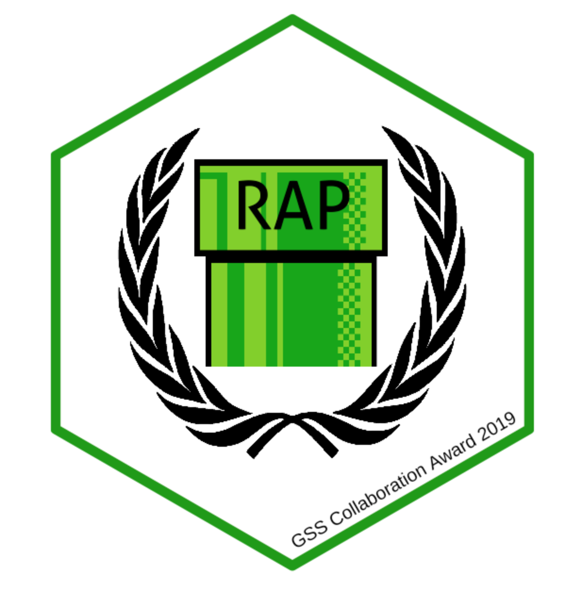

# rap-gss-nom

* Collaboration which improved data and methods
*	Ways of working which enabled effective collaboration
*	Collaboration which enhanced the insight and understanding of the findings
*	Collaboration with stakeholders such as other teams in your department, other government departments, organisations outside government, topic and method experts, other analytical professions, policy professionals, producers of related statistics, international organisations and researchers

The RAP Champions network has enhanced the capability of statisticians across government. 
It was founded in 2018.
Originally, it had 17 departments represented at the first meet-up but this has now grown to 26 departments.
The network is across all analytical professions, drawing in expertise from different backgrounds. 

RAP, reproducible automated pipeline, is a methodology for automating the bulk of steps involved in creating a statistical report, whilst allowing analysis to be reproduced in the future and avoiding errors introduced by manual processes. 
It is estimated that each RAP creates a benefit of £8.8k in efficiencies per year, although the benefits of RAP are far broader than efficiency.
The aim of the RAP Champions network has been to prepare departments for the introduction of RAP processes by improving capability and identifying best practice. 
The RAP Champions network has pioneered collaborative ways of working to build this capability in RAP across government. 
This increased capability has led and will lead to better quality statistical outputs, delivered more efficiently in a timelier manner.

The RAP Champions network, aside from hosting face-to-face meetups, maintains contact using slack – an internet chat room which enables in-depth discussions and facilitates knowledge sharing. 
The slack group is well attended with 532 members with approximately 135 messages posted per month. 
This has facilitated cross-government knowledge sharing and collaboration.

For instance, the RAP Champions have collaborated to produce the RAP website which is hosted on github. 
The RAP website acts as a single repository for information developed by the network.
Github has allowed RAP Champions to contribute their knowledge directly to the website, by opening discussions and issues, and allowing collaboration with other Champions. 
These discussions remain in place and allow previous conversations to be referenced when identifying new ways forwards. 
For instance, packrat was identified as the best dependency management solution for R; however, following discussion amongst RAP Champions, it was agreed to caveat this and offer alternative approaches in the shared documentation – leaving open the discussion for future technologies.

The RAP Companion is a guidebook, collaboratively developed by the RAP Champions, which explains a pathway to implementing RAP in organisations.
This primer resource has been 

The network has promoted work from its members, including the RAP massive open online course (MOOC) produced by Matthew Gregory.
This MOOC is a strong example of knowledge sharing and draws from the experience of colleagues across DCMS, MOJ and DfE.
The MOOC has had 5668 enrolments, and is rated 4.13 stars.
One review states it is a “\[r]eally excellent, hands on, project-oriented course.
The course teaches very useful principles for coding practice and a variety of tools that aid not only in RAP.
I find it as one of the best courses for pipeline automation. 
You would be hard pressed to find R courses on Udemy so rich in resources and so neatly packaged. 
Can't recommend it more!”

The network and collaboration enable Champions to become method experts. 
They are then able to disseminate knowledge within their departments, and they can bring back views/practice from their departments to the network. 
The network has shared knowledge and provided backing to undo blockers between RAP Champions. 
For instance, Aoife O’Neill (DWP RAP Champion) notes "Laura Selby \[DfE RAP Champion] met and answered all my questions around Feb 2018\[.] 
\[S]ince then I've had phone calls with MOD, Anna Price's team at NHS Scotland, a linked in message from a \[statistician] at the home office who I've pointed to RAP resources and several conversations with VOA (an arms length body of HMRC)\[.] 
\[T]he intel obtained from Laura meant I could challenge conventional wisdom in my department which sometimes pushed back on RAP/open source, without which I don't think I would have gotten any traction with regards to RAP. 
Now \[I’m] trying to pass this on."

Whilst, within departments, RAP Champions facilitate and promote RAP to colleagues. 
Edisa Livingstone (MOJ Statistician) notes “My RAP champion Aidan has been vital in progressing RAP within my team. 
This is because I am in a production heavy team which also receives a large \[number] of FOIs and PQs, therefore I simply wouldn’t have time to attend meetings or organise R or GitHub training on my own. 
Apart from providing a wealth of training courses through his Statistical Project Delivery Team which I have enjoyed, he coordinates the RAP approach and crucially straddles the gap between our HoP/senior analysts and the statistical teams themselves with regular catch-ups. 
This encourages a better understanding of the challenges and benefits of RAPping amongst the higher levels which we need to be able to take RAP forward. 
Being the only RAPper embedded in a busy production team is challenging within itself, but the RAP champion creates an extra level of support at the frontline of statistical production. 
He makes the time to keep up-to-date with RAP across MoJ and makes it easier to share knowledge across teams. 
For example, through his RAP meetings I am aware of work \[another analyst] has collaborated on with \[a data engineer] about lookups which my own team will be able to take forward.”
